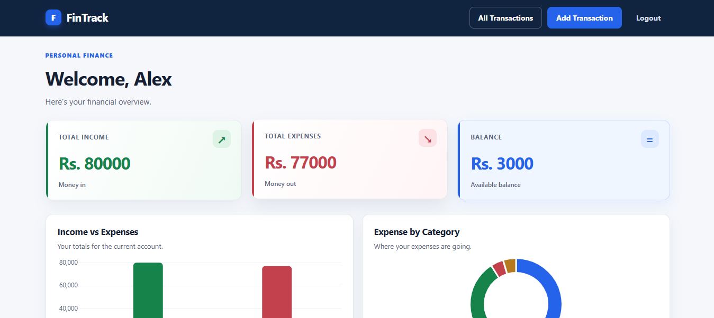
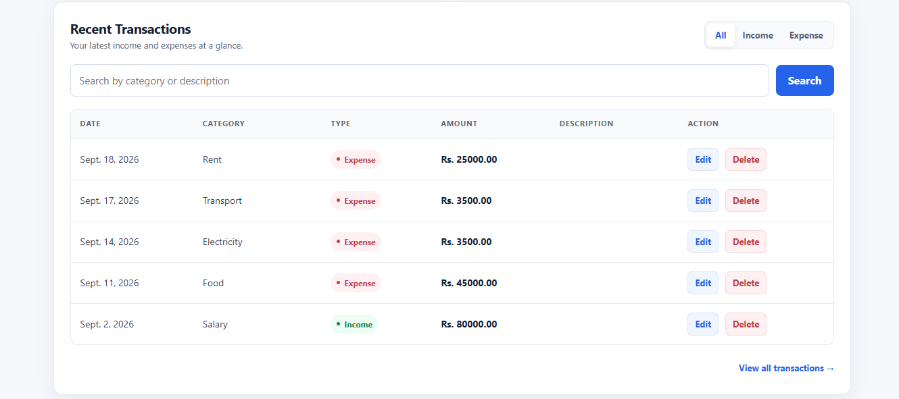
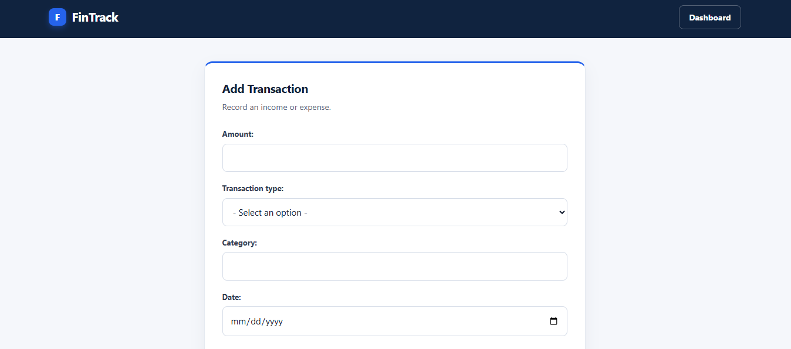

# 💰 FinTrack

FinTrack is a personal finance tracking web application built with **Django**. It helps users manage their income and expenses, track their balance, search transactions, and understand their spending through simple visual analytics.

## ✨ Features

- User registration, login, and logout
- Add, edit, and delete transactions
- Track income and expenses
- Dashboard with total income, expenses, and balance
- Income vs. expense analytics
- Expense breakdown by category
- Search and filter transactions
- Paginated transaction history
- Secure user-specific transaction management

## 🛠️ Tech Stack

**Backend:** Python, Django  
**Frontend:** HTML, CSS, JavaScript, Chart.js  
**Databases:** SQLite, PostgreSQL  
**DevOps & Tools:** Docker, Docker Compose, GitHub Actions, Git, Gunicorn, WhiteNoise

## ⚙️ Engineering & DevOps

FinTrack supports **PostgreSQL** and includes a **Docker Compose** environment for running the Django application and PostgreSQL together.

A **GitHub Actions CI pipeline** automatically performs Django system checks and runs **17 automated tests** on pushes and pull requests.

Sensitive configuration such as secret keys and database credentials is managed through **environment variables** and excluded from version control.

## 📸 Screenshots

### Dashboard

### Transactions

### Add Transaction

## 👩‍💻 Author

**Tharindi Anuththara**  
Software Engineering Undergraduate  
NSBM Green University, Sri Lanka
